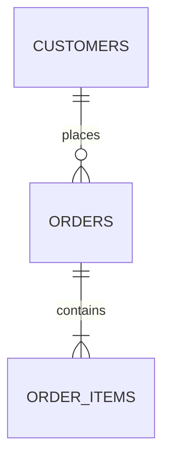

# Schema Documentation Generator

Generate complete documentation from your database schema definitions.

## Step 1 — Extract Schema Metadata

Read the provided DDL scripts, migration files, or database catalog queries to extract:

- All tables with their columns, data types, nullability, and defaults
- Primary keys, foreign keys, and unique constraints
- Indexes (clustered, non-clustered, filtered)
- Check constraints and computed columns
- Views, stored procedures, and functions (signatures and purpose)
- Triggers and their events

Save the raw extraction to `schema-docs/metadata.md`.

## Step 2 — Generate Data Dictionary

Create a data dictionary organized by schema/table in `schema-docs/data-dictionary.md`:

### Table: `schema.table_name`

**Purpose:** Brief description of what this table stores.

| Column | Type | Nullable | Default | Description |
|--------|------|----------|---------|-------------|
| `id` | `INT` | No | `IDENTITY` | Primary key |
| `email` | `VARCHAR(255)` | No | — | User's email address, unique |

**Relationships:**
- `customer_id` → `customers.id` (many-to-one)
- Referenced by: `order_items.order_id`

**Indexes:**
- `PK_orders` (clustered) on `id`
- `IX_orders_customer_date` on `customer_id`, `order_date`

## Step 3 — Generate Relationship Map

Create a textual entity-relationship description in `schema-docs/relationships.md`:

- List all foreign key relationships grouped by domain area
- Identify circular dependencies
- Document cascade rules (CASCADE, SET NULL, RESTRICT)
- Flag orphan tables (no FK relationships)

Include a Mermaid ERD diagram for visualization:

## Step 4 — Generate Change Log Template

Create a schema change log template in `schema-docs/changelog-template.md`:

- Template for documenting schema changes
- Version numbering scheme
- Required fields: date, author, tables affected, migration script reference
- Review checklist for schema changes
