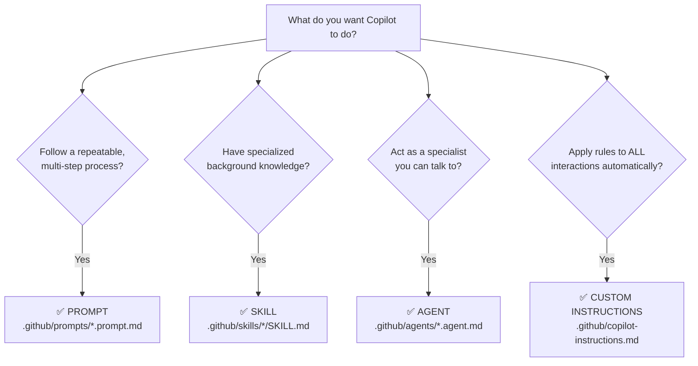

# When to Use an Agent vs a Skill vs a Prompt

Not sure which Copilot resource type to reach for? Start with this question:

> **"Do I want to _talk_ to Copilot about this, or do I want Copilot to just _know_ it?"**

- **Talk to it** → Agent (interactive) or Prompt (structured workflow)
- **Just know it** → Skill (domain knowledge) or Instructions (project rules)

---

## Decision Tree

---

## Quick Reference

| | Agent | Skill | Prompt | Instructions |
|---|:---:|:---:|:---:|:---:|
| **Invoke explicitly?** | Yes | No | Yes | No |
| **Adopts a persona?** | Yes | No | No | No |
| **Always active?** | No | Yes | No | Yes |
| **Runs multi-step workflow?** | No | No | Yes | No |
| **Enforces project rules?** | No | No | No | Yes |
| **Best for conversations?** | ✅ | — | — | — |
| **Best for reference knowledge?** | — | ✅ | — | — |
| **Best for repeatable processes?** | — | — | ✅ | — |
| **Best for coding standards?** | — | — | — | ✅ |

---

## Real Examples from This Repo

### "I want Copilot to know SQL Server best practices"
→ **Skill** ([sql-server](../.github/skills/sql-server/SKILL.md))
Copilot silently references T-SQL patterns, DMV queries, and configuration guidelines whenever you ask about SQL Server.

### "I want to run a full database health check"
→ **Prompt** ([health-check.prompt.md](../.github/prompts/health-check.prompt.md))
You run the prompt and Copilot walks through collecting metrics, assessing health, creating a remediation plan, and setting up monitoring — every time.

### "I want Copilot to review my query like a performance expert"
→ **Agent** ([query-optimizer.agent.md](../.github/agents/query-optimizer.agent.md))
You invoke `@query-optimizer` in chat and have a back-and-forth conversation about execution plans, index strategies, and query rewrites.

### "I want every SQL script to follow our naming conventions"
→ **Custom Instructions** ([copilot-instructions.md](../.github/copilot-instructions.md))
Copilot automatically applies PascalCase naming, uppercase keywords, and includes rollback scripts — without being asked.

---

## Common Combinations

These types work well together:

| Combination | Example |
|-------------|---------|
| **Skill + Agent** | The SQL Server skill provides DMV knowledge; the incident-responder agent uses it when diagnosing issues |
| **Skill + Prompt** | The indexing skill provides strategies; the index-analysis prompt runs a structured audit using that knowledge |
| **Instructions + Agent** | Instructions enforce naming conventions; the schema-reviewer agent follows them when reviewing designs |
| **Prompt + Agent** | The health-check prompt generates findings; you invoke the incident-responder to discuss and prioritize them |

---

## Still Not Sure?

Ask yourself: **"Do I want to _talk_ to Copilot about this, or do I want Copilot to just _know_ it?"**

- **Talk to it** → Agent (interactive) or Prompt (structured)
- **Just know it** → Skill (domain knowledge) or Instructions (project rules)
